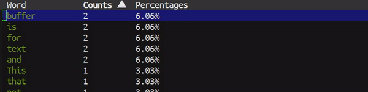

# modablist
> Modifiable tabulated-list extension.

  

This package makes `tabulated-list` editable like spreadsheet.

By the current implementation this package alone doesn't do much. You
would probably need to extend this package and treat this as a `library`
or `framework`.

## Features

* Editable table
* Add new row (empty)
* Table box selection

## Work with upstream

Most packages would probably have their own variable that contains all data
to and just use `tabulated-list` to display it. Yet this package respect data
from `tabulated-list` itself and **NOT** the data from their variable.

Here is the list of open API/hooks for you to update the upstream database
from user.

* `modablist-new-data-hook`
* `modablist-change-data-hook`

## Faces

The following list of faces are possible to customize.

* `modablist-select-face` - Overlay face when selecting.
* `modablist-insert-face` - Overlay face when inserting.

## Contribution

If you would like to contribute to this project, you may either
clone and make pull requests to this repository. Or you can
clone the project and establish your own branch of this tool.
Any methods are welcome!
